<div align="center">


# Finance Copilot

**Finanças pessoais com Open Finance e um assistente de IA que só fala de números que o app calculou.**

[](https://github.com/mrquintao/finance-copilot/actions/workflows/backend.yml)
[](https://github.com/mrquintao/finance-copilot/actions/workflows/web.yml)
[](LICENSE)


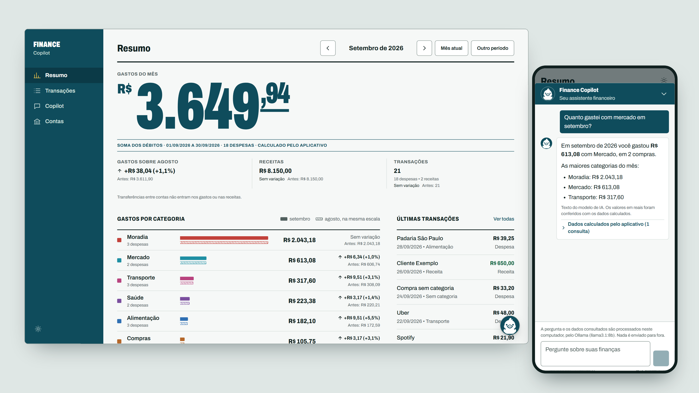

</div>

## Sobre

O Finance Copilot junta as contas de várias instituições num só lugar, categoriza os gastos e responde perguntas como *"quanto gastei com mercado em setembro?"* ou *"gastei mais que no mês anterior?"*.

A decisão central do projeto é que **o modelo de linguagem nunca calcula dinheiro**. Ele só escolhe quais consultas rodar e redige a resposta. Os valores vêm das mesmas queries SQL determinísticas que alimentam as telas. Antes de mostrar a resposta, o backend confere cada valor em reais do texto contra o resultado dessas consultas. Se aparecer um número que nenhuma consulta devolveu, a resposta é retida.

É um projeto pessoal, de um usuário só, que roda na própria máquina. Por padrão o Copilot usa um modelo local via [Ollama](https://ollama.com), e nem a pergunta nem os dados saem do computador.

## Funcionalidades

| Área | O que faz |
| --- | --- |
| 🏦 **Open Finance** | Conexão pelo widget Pluggy Connect (conta MeuPluggy), importação paginada de contas e transações, deduplicação por id externo e histórico de sincronizações com falhas classificadas. |
| 📊 **Resumo** | Gasto do mês com a procedência do cálculo, receitas, categorias comparadas com o período anterior na mesma escala, observações por regras fixas e projeção do gasto até o fim do mês. A navegação é mês a mês, com outros intervalos a um clique. |
| 🔎 **Transações** | Lista paginada com busca por descrição ou estabelecimento e filtros por conta, categoria e tipo. O período e os filtros ficam na URL, e cada categoria do Resumo leva à lista já filtrada. |
| 🧾 **Contas** | Visão consolidada por instituição, com estado da última sincronização e contagem de transações. |
| 💬 **Copilot** | Perguntas em linguagem natural, respostas com o período considerado, a fonte de cada cálculo e links para as transações que sustentam a resposta. |
| 🦆 **Chat flutuante** | O pato no canto inferior direito abre a conversa com o Copilot em qualquer tela, usando o mesmo backend da tela Copilot. A conversa fica só na memória do navegador: continua ao trocar de tela e some ao recarregar a página. |
| 💡 **Insights e auditoria** | Insights por regras fixas (sem LLM) e um relatório de qualidade dos dados, somente leitura, que aponta duplicatas, lacunas de sincronização e valores suspeitos. |
| 🌓 **Web e PWA** | Interface responsiva com tema claro e escuro, instalável no iPhone pela tela de início. |

## Telas

Todas as telas abaixo usam dados fictícios, servidos por uma API simulada só para as capturas.

<table>
  <tr>
    <td width="50%">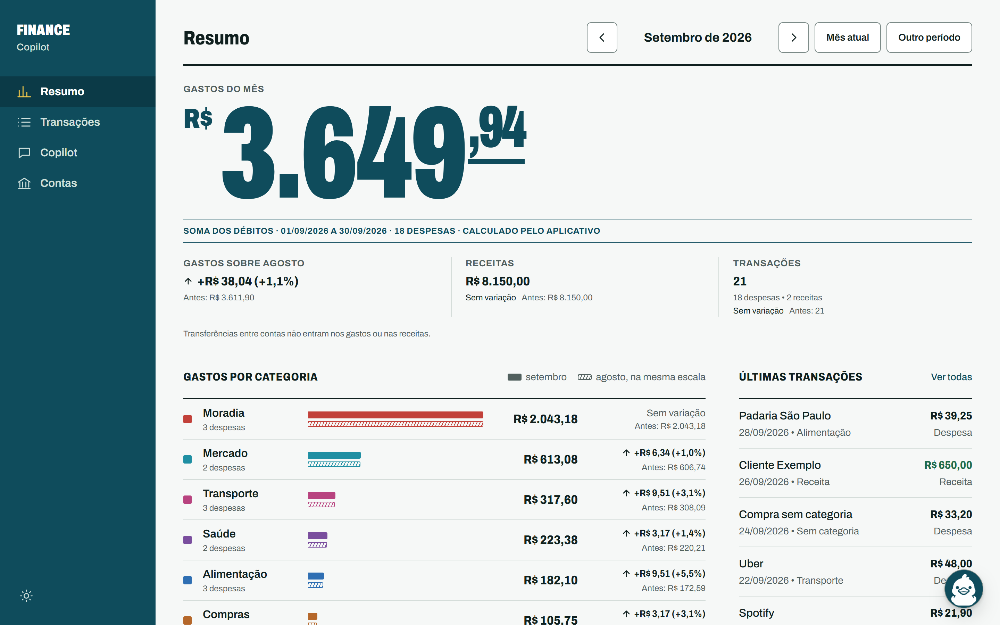<br><sub><b>Resumo</b>: gasto do mês com a procedência do cálculo, categorias comparadas com o mês anterior na mesma escala</sub></td>
    <td width="50%">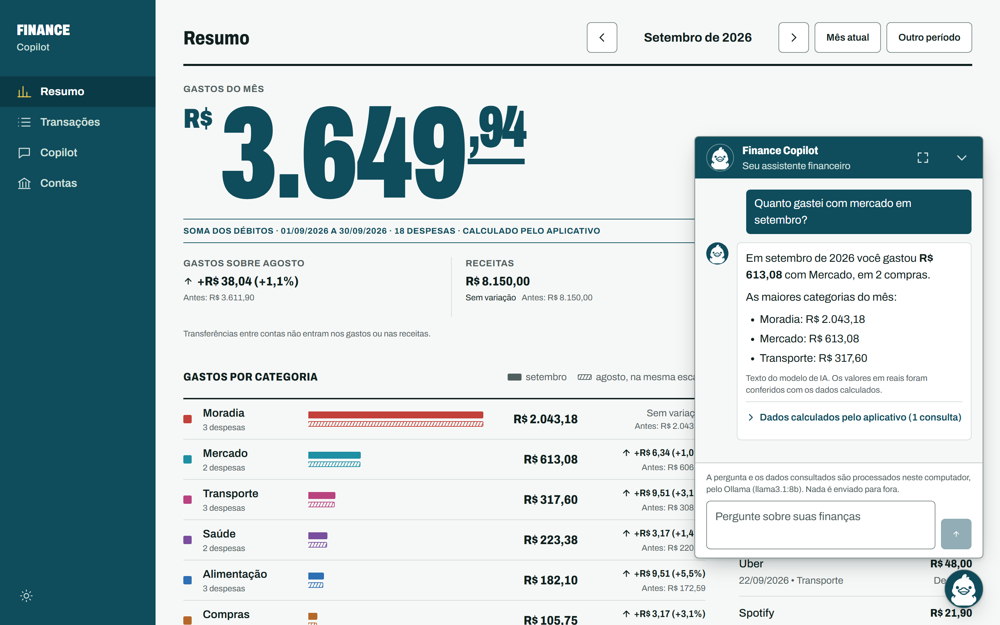<br><sub><b>Chat flutuante</b>: o pato abre a conversa com o Copilot em qualquer tela</sub></td>
  </tr>
  <tr>
    <td>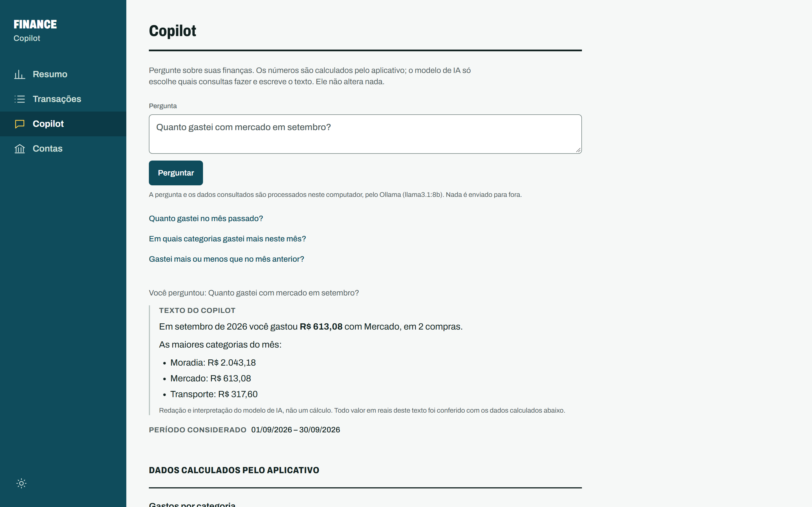<br><sub><b>Copilot</b>: texto do modelo separado dos dados calculados pelo app</sub></td>
    <td>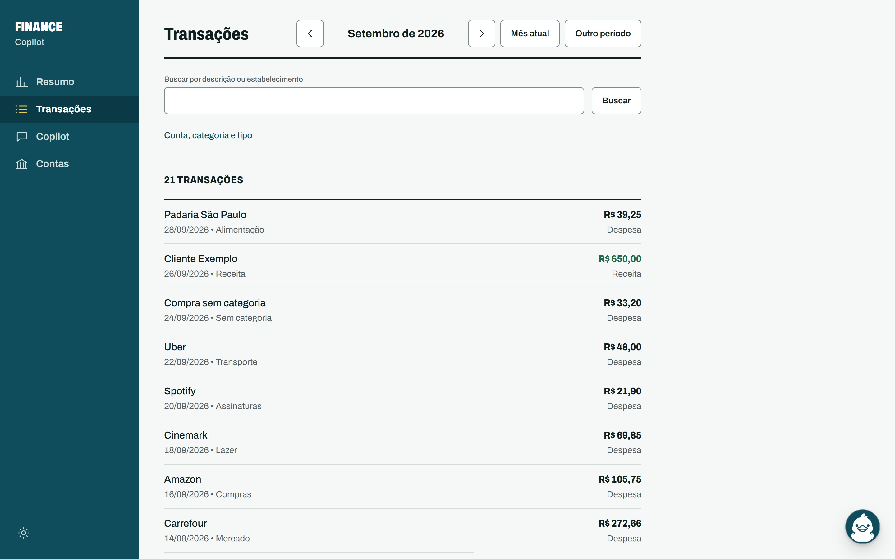<br><sub><b>Transações</b>: navegação por mês, busca, filtros e paginação</sub></td>
  </tr>
  <tr>
    <td>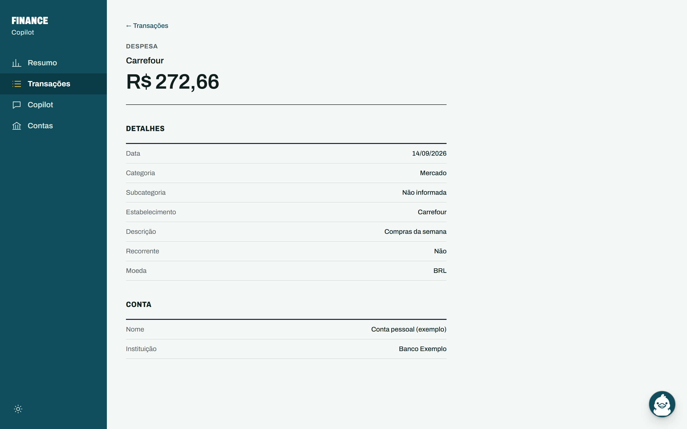<br><sub><b>Detalhe</b>: cada transação tem rota própria</sub></td>
    <td>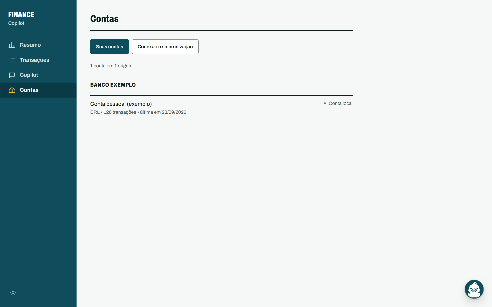<br><sub><b>Contas</b>: agrupadas por instituição</sub></td>
  </tr>
  <tr>
    <td>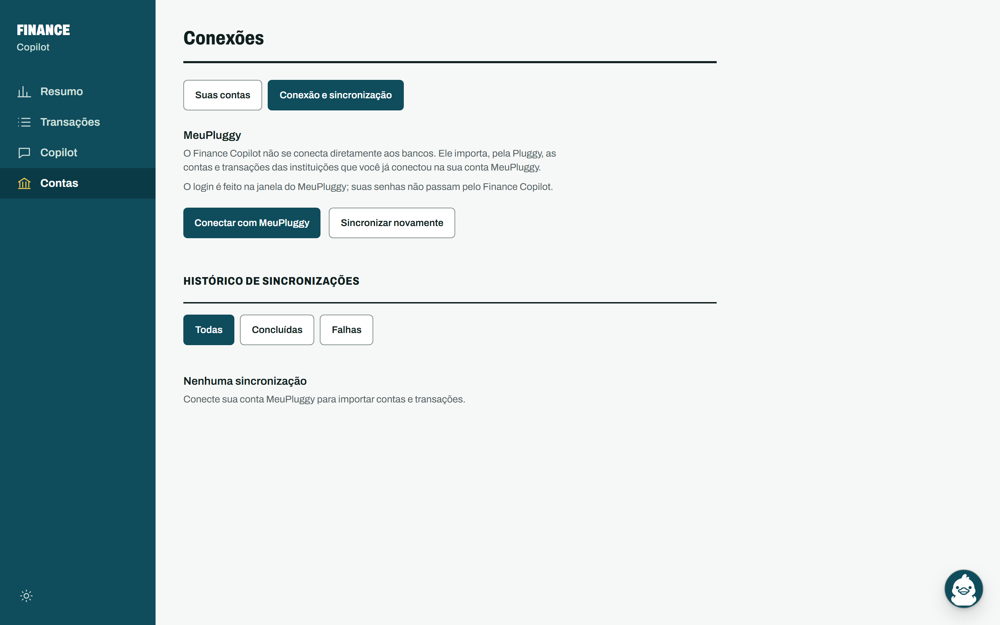<br><sub><b>Conexão e sincronização</b>: conectar instituição e sincronizar de novo</sub></td>
    <td>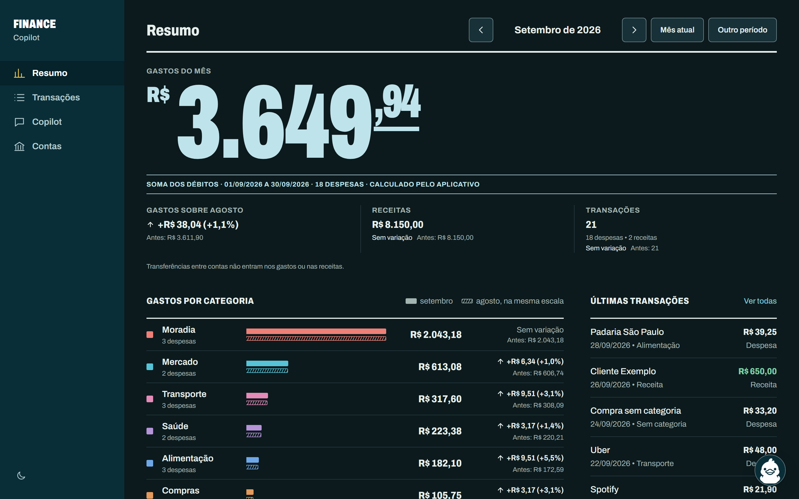<br><sub><b>Tema escuro</b>: segue o sistema ou a escolha do usuário</sub></td>
  </tr>
</table>

<p align="center">
  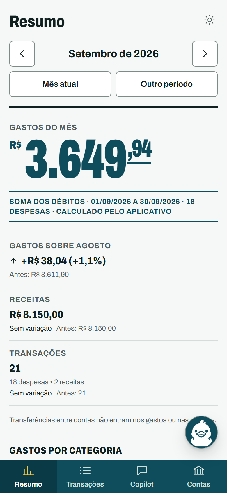
  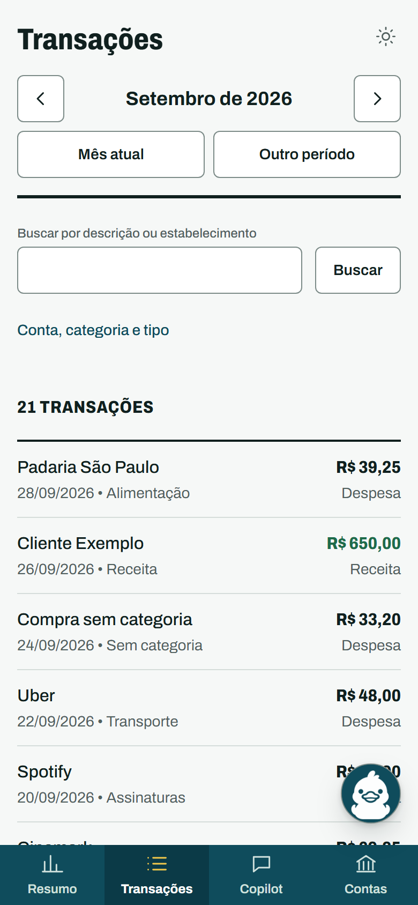
  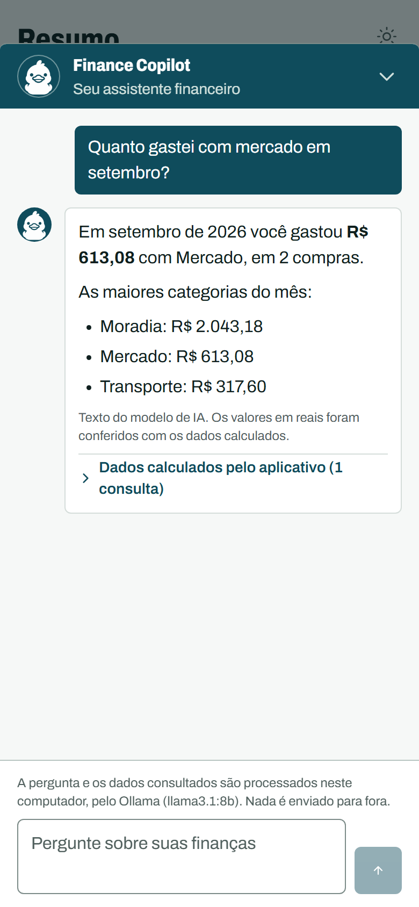
  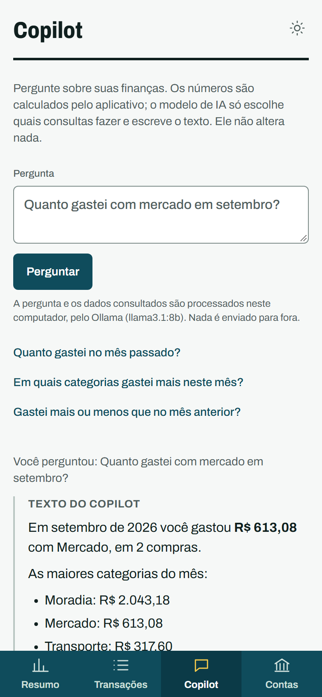
</p>

## Arquitetura

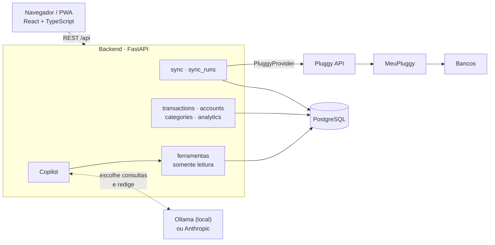

- As credenciais da Pluggy ficam **só no backend**. O cliente web recebe apenas um Connect Token de curta duração, gerado pelo backend, e abre o widget com ele.
- O cliente chama a API sempre em `/api`, na própria origem. Em desenvolvimento o Vite faz o proxy, então o backend não habilita CORS.
- O acesso ao Open Finance passa pela abstração `FinancialDataProvider`. O `PluggyProvider` é a implementação atual.

### Stack

| Camada | Tecnologias |
| --- | --- |
| Backend | Python 3.12, FastAPI, Pydantic 2, SQLAlchemy 2, Alembic, httpx |
| Banco | PostgreSQL 18, dinheiro em `NUMERIC(18,2)` |
| Web | React 19, TypeScript strict, Vite, React Router, TanStack Query, Tailwind CSS, fontes Red Hat servidas pelo próprio app |
| IA | Ollama (padrão, local) ou API da Anthropic, atrás de uma interface `LLMProvider` |
| Qualidade | pytest, Ruff, Vitest, Testing Library, MSW, ESLint, GitHub Actions |

## Como o Copilot evita números inventados

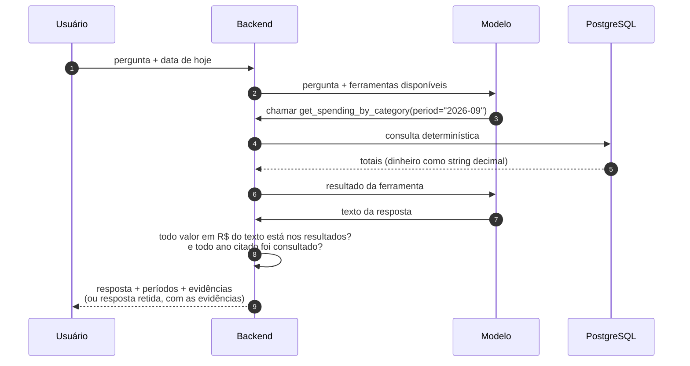

- **Somente leitura.** Existem cinco ferramentas, todas de consulta: `get_spending_summary`, `get_spending_by_category`, `get_period_comparison`, `search_transactions` e `list_categories`. Nenhuma escreve, apaga, categoriza ou sincroniza.
- **Valores conferidos.** O backend extrai os valores em reais do texto e os compara, como decimais exatos, com os valores que as ferramentas devolveram na mesma pergunta. Um valor que não veio de nenhuma consulta, seja inventado ou somado pelo próprio modelo, faz a resposta ser retida (status `ungrounded`). Também é retida a resposta que cita um ano que nenhuma consulta cobriu.
- **Evidências montadas pelo backend.** `evidence` lista as consultas que de fato rodaram. Cada uma traz a fonte do cálculo, o período, os fatos calculados, os filtros aplicados e um link para a tela de Transações com os mesmos filtros. Nada disso vem do texto do modelo.
- **Fato separado de interpretação.** Na tela, o texto do modelo e os dados calculados aparecem separados e rotulados.
- **Tolerante a modelos pequenos.** O período é passado como uma string simples (`"2026-09"`, `"2025"`, `"previous_month"`, `"2026-03-01..2026-03-15"`), e valores de preenchimento como `""` ou `"None"` em campos opcionais são tratados como ausentes.
- **O que vai para o modelo:** a pergunta, a data e os resultados das ferramentas chamadas. Nunca vão credenciais, tokens, ids da Pluggy ou nomes de contas e instituições. Perguntas, respostas e resultados não são registrados em log.
- **Limites:** uma pergunta por requisição, sem histórico de conversa, e no máximo 6 rodadas do modelo por pergunta. O chat flutuante mostra as perguntas em sequência, mas cada uma é respondida de forma independente: o modelo não vê as anteriores.

## Rodando localmente

**Requisitos:** Python 3.12+, Node.js LTS e Docker com Compose v2 (ou um PostgreSQL 18 próprio). Para o Copilot, [Ollama](https://ollama.com) com um modelo que suporte ferramentas.

```sh
# 1. Configuração
cp .env.example .env          # escolha uma senha para o PostgreSQL

# 2. Backend
python -m venv .venv
source .venv/bin/activate     # Windows: .venv\Scripts\activate
pip install -e "backend[test]"
python scripts/dev.py db      # sobe o PostgreSQL no Docker
python scripts/dev.py migrate
python scripts/dev.py seed-demo   # opcional: dataset fictício
python scripts/dev.py api     # http://127.0.0.1:8000

# 3. Web (outro terminal)
cd web
npm install
npm run dev                   # http://localhost:5173

# 4. Copilot (opcional)
ollama pull llama3.1:8b
```

O dataset de demonstração cobre abril a setembro de 2026. Para vê-lo, volte mês a mês com o navegador de mês do cabeçalho ou abra **Outro período** e informe esse intervalo.

Para subir tudo em containers: `docker compose up -d --build`. Os dados ficam no volume `postgres_data` e sobrevivem a `docker compose down`. Já `docker compose down -v` apaga o volume e todos os dados financeiros junto.

<details>
<summary><b>Comandos do projeto</b></summary>

| Comando | Função |
| --- | --- |
| `python scripts/dev.py db` / `up` / `down` | PostgreSQL ou a stack inteira no Docker |
| `python scripts/dev.py migrate` | Aplica as migrations |
| `python scripts/dev.py api` | Sobe a API |
| `python scripts/dev.py test` / `lint` | Testes e lint do backend |
| `python scripts/dev.py seed-demo` | Insere o dataset fictício (recusa rodar se houver contas importadas) |
| `python scripts/dev.py check-demo` | Mostra o que o `clean-demo` removeria, sem remover |
| `python scripts/dev.py clean-demo` | Remove só o dataset fictício, pelos UUIDs fixos do seed |
| `python scripts/dev.py audit-data` | Relatório de qualidade dos dados, somente leitura |
| `npm run dev` / `build` | Servidor de desenvolvimento / build de produção em `web/dist` |
| `npm run lint` / `typecheck` / `test` | ESLint, TypeScript strict e Vitest com a API mockada (MSW) |

</details>

<details>
<summary><b>Variáveis de ambiente</b></summary>

| Variável | Uso |
| --- | --- |
| `DATABASE_URL` | Conexão PostgreSQL do backend |
| `TEST_DATABASE_URL` | Banco dos testes (cada execução usa um schema temporário e o apaga no fim) |
| `BACKEND_BIND` | `127.0.0.1` por padrão; `0.0.0.0` só em LAN confiável |
| `BACKEND_PORT` | Porta HTTP; padrão 8000 |
| `PLUGGY_CLIENT_ID` / `PLUGGY_CLIENT_SECRET` | Credenciais da aplicação Pluggy, só no backend |
| `PLUGGY_BASE_URL` | API Pluggy; padrão `https://api.pluggy.ai` |
| `COPILOT_PROVIDER` | `ollama` (padrão) ou `anthropic` |
| `COPILOT_MODEL` | Padrão `llama3.1:8b` no Ollama e `claude-opus-5-5` na Anthropic |
| `OLLAMA_BASE_URL` | Padrão `http://127.0.0.1:11434` |
| `ANTHROPIC_API_KEY` | Só com `COPILOT_PROVIDER=anthropic`, só no backend |
| `API_PROXY_TARGET` | Em `web/.env`: para onde o Vite repassa `/api` |

</details>

<details>
<summary><b>Copilot: modelo local ou hospedado</b></summary>

**Ollama (padrão).** O modelo roda no próprio computador: não há chave, não há custo por pergunta e os dados não saem da máquina. Instale o Ollama, deixe-o aberto e baixe um modelo com suporte a ferramentas (`ollama pull llama3.1:8b`). Para usar outro, defina `COPILOT_MODEL`, por exemplo `qwen2.5:7b`.

Um modelo local é mais lento (de segundos a minutos por resposta, conforme o hardware) e segue instruções com menos precisão. Os guardrails valem do mesmo jeito: na prática, isso significa mais respostas retidas ou incompletas, não respostas com números errados. O modelo fica carregado por 30 minutos entre perguntas.

**Anthropic (opcional).** Com `COPILOT_PROVIDER=anthropic` e `ANTHROPIC_API_KEY`, o Copilot fica mais rápido e preciso, mas cada pergunta tem custo e envia a pergunta e os resultados das consultas para fora do computador. A tela avisa quando isso acontece.

Erros comuns: Ollama fechado retorna 502; modelo não baixado ou sem suporte a ferramentas retorna 503, com o comando `ollama pull` na mensagem.

</details>

## API

<details>
<summary><b>Rotas</b></summary>

| Método e rota | Função |
| --- | --- |
| `GET /health` | Readiness do backend e do PostgreSQL |
| `GET /transactions` | Lista paginada; filtros por período, `q` (texto), `account_id`, `category_id` e `type` |
| `GET /transactions/{id}` | Detalhe da transação |
| `GET /categories` | Categorias |
| `GET /accounts` | Contas por instituição, com estado da sincronização |
| `GET /analytics/spending-summary` | Gastos, receitas e contagens |
| `GET /analytics/spending-by-category` | Gastos por categoria |
| `GET /analytics/period-comparison` | Comparação com o período anterior equivalente |
| `GET /analytics/insights` | Insights por regras fixas, sem LLM |
| `GET /analytics/month-projection` | Projeção do gasto até o fim do mês, com as premissas na resposta |
| `POST /sync/connect-token` | Gera um Connect Token com as credenciais do backend |
| `POST /sync` | Sincroniza um `item_id` (datas opcionais e inclusivas) |
| `POST /sync/refresh` | Sincroniza de novo todos os Items conhecidos; a falha de um não interrompe os outros |
| `GET /sync/runs` | Últimas 50 sincronizações, com filtros `status` e `item_id` |
| `POST /copilot/ask` | Responde uma pergunta usando as ferramentas somente leitura |
| `GET /copilot/status` | Provedor e modelo do Copilot e se os dados ficam no computador |

```http
POST /copilot/ask
Content-Type: application/json

{ "question": "Quanto gastei com alimentação no mês passado?", "today": "2026-10-07" }
```

`today` é a data local do usuário: o backend não decide o que é "hoje" nem "mês passado".

Status possíveis da resposta: `answered`, `ungrounded` (retida pelo guardrail), `refused` (o modelo se recusou) e `incomplete` (não chegou a uma resposta).

</details>

## Open Finance

O app não tem acesso comercial ao Open Finance e não se conecta direto aos bancos. As instituições são conectadas pelo usuário no **MeuPluggy**, o agregador pessoal gratuito da Pluggy, e o app importa o que esse Item expõe.

1. Na tela **Conexões**, o web pede um Connect Token ao backend (`POST /sync/connect-token`).
2. O widget Pluggy Connect abre direto no MeuPluggy e o usuário faz login.
3. Quando o widget confirma, o web chama `POST /sync` com o `item_id`.
4. O backend busca as contas e as transações de cada conta, normaliza, deduplica e grava no PostgreSQL.
5. **Sincronizar novamente** relê os Items já conhecidos e importa tudo de novo. Como tudo é upsert, uma importação incompleta é corrigida pela seguinte.

Detalhes:

- Contas são identificadas por `(provider, provider_account_id)` e transações por `(account_id, external_id)`.
- Só entram contas e transações em BRL, e só transações `POSTED`.
- Erros transitórios, 429 e 5xx são repetidos. A API key é renovada após um 401.
- Falhas da Pluggy viram mensagens montadas a partir do status HTTP. O corpo da resposta nunca vai para a API, para `sync_runs` ou para os logs.

## Regras financeiras

- Dinheiro é `Decimal` no Python, `NUMERIC(18,2)` no banco e string com duas casas no JSON. Nunca `float`.
- `amount` é sempre não negativo. `debit` é despesa, `credit` é receita e `transfer` é movimentação interna, que não entra em gastos nem em receitas.
- O cliente web formata dinheiro em BRL sem converter para `number`. A única conversão fica em `web/src/lib/barScale.ts`, só para dimensionar barras; o resultado nunca é exibido nem somado.
- A projeção do mês é uma estimativa. O gasto variável até a data é extrapolado pela média diária, e os gastos recorrentes entram pelo valor real. A resposta traz as premissas e os dias decorridos.
- Um insight só é gerado para variações de pelo menos R$ 50,00 e, quando há valor anterior, de pelo menos 20%.

<details>
<summary><b>Auditoria de qualidade dos dados</b></summary>

`python scripts/dev.py audit-data` imprime um relatório **somente leitura**. Ele nunca apaga nem corrige nada e mostra só contagens, datas e ids internos: nenhuma descrição, valor ou identificador da Pluggy.

| Verificação | O que sinaliza |
| --- | --- |
| `possible_duplicates` | Mesma conta, data, valor, tipo e descrição. São candidatas a conferir, não erros |
| `missing_external_ids` | Transações importadas sem o id usado na deduplicação |
| `item_never_synchronized` | Item sem nenhuma sincronização bem-sucedida |
| `stale_synchronization` | Item sem sincronização bem-sucedida há mais de 7 dias |
| `historical_sync_gap` | Item que já ficou mais de 7 dias entre duas sincronizações |
| `account_without_transactions` | Conta importada sem transações |
| `zero_amount`, `future_date`, `implausibly_old_date`, `blank_description` | Valores aceitos pelo schema que dificilmente estão certos |

</details>

## Qualidade e testes

- **Backend:** pytest contra um PostgreSQL real, num schema temporário criado e apagado a cada execução. Ruff para lint e formatação.
- **Web:** Vitest e Testing Library, com a API mockada por MSW. ESLint e TypeScript strict.
- **CI:** dois workflows no GitHub Actions. O do backend aplica as migrations num PostgreSQL 18 e roda lint e testes. O do web roda lint, typecheck, testes e build.

## Status e roadmap

| Versão | Entregas |
| --- | --- |
| MVP 0.1 | Core financeiro: contas, categorias, transações, analytics e dataset de demonstração |
| MVP 0.2 | Open Finance via Pluggy: importação, deduplicação e histórico de sincronizações |
| MVP 0.3 (atual) | Cliente web e PWA, filtros, contas consolidadas, comparação de períodos, insights, projeção do mês, auditoria de dados e o Copilot |

Próximos passos, acompanhados nas [issues](https://github.com/mrquintao/finance-copilot/issues):

- autenticação e deploy com HTTPS ([#19](https://github.com/mrquintao/finance-copilot/issues/19));
- categorias editáveis e regras por estabelecimento ([#6](https://github.com/mrquintao/finance-copilot/issues/6));
- transações recorrentes e orçamento por categoria ([#7](https://github.com/mrquintao/finance-copilot/issues/7), [#8](https://github.com/mrquintao/finance-copilot/issues/8));
- webhooks da Pluggy e sincronização automática ([#10](https://github.com/mrquintao/finance-copilot/issues/10)).

A visão completa do produto está em [docs/vision.md](docs/vision.md).

O app começou com um cliente iOS em SwiftUI, substituído pelo web quando este chegou à paridade. O último estado dele está na tag [`ios-mvp-0.2`](https://github.com/mrquintao/finance-copilot/tree/ios-mvp-0.2).

## Segurança e limites

> [!WARNING]
> A API ainda **não tem autenticação**. Com dados reais, não exponha o backend nem o servidor do Vite à internet. Para testar no celular, use só uma rede local confiável (`npm run dev -- --host`).

- Segredos ficam no `.env`, que não é versionado, e nunca chegam ao cliente web.
- O cliente não guarda tokens nem dados financeiros no navegador. Só a preferência de tema fica em `localStorage`.
- O adapter da Pluggy não registra corpos de resposta nem credenciais, e os erros gravados em `sync_runs` são sanitizados.
- As respostas da API usam `Cache-Control: no-store`.

## Licença

[MIT](LICENSE) © 2026 Mateus Ribeiro Quintão
